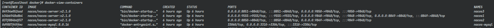
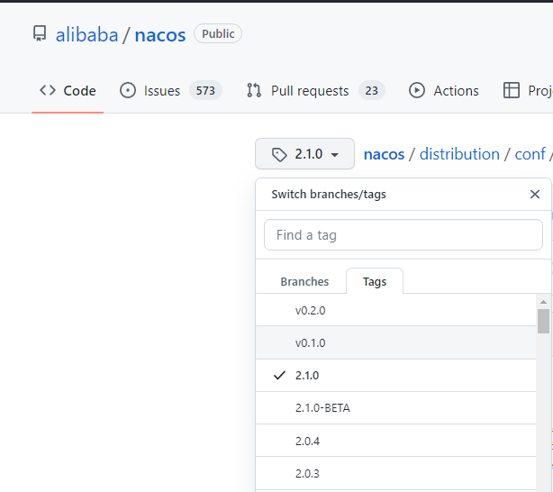

### 一、Docker集群部署

**S1：创建目录**

```bash
# cd /home/ws/docker
# mkdir -p nacos-cluster
```

**S2：克隆nacos-docker项目**

```bash
# cd nacos-cluster
# git clone --depth 1 https://github.com/nacos-group/nacos-docker.git
```

**S3：进入 `nacos-docker` 目录**

```bash
# cd nacos-docker
```

**S4：创建环境变量配置文件 `.env`** 

```bash
# touch .env
# vim .env
```

```properties
# container image version
NACOS_VERSION=v2.1.0
NACOS_MYSQL_VERSION=8.0.16

# nacos's mysql port
NACOS_MYSQL_PORT=3310
# nacos-mysql container ip
NACOS_MYSQL_CONTAINER_IP=172.18.33.5
# nacos node1 container ip
NACOS_NODE1_CONTAINER_IP=172.18.33.2
# nacos node2 container ip
NACOS_NODE2_CONTAINER_IP=172.18.33.3
# nacos node3 container ip
NACOS_NODE3_CONTAINER_IP=172.18.33.4 
```

**S5：修改 `env`目录下的 `mysql.env` 和 `nacos-ip.env` 文件**

```bash
# cd env
```

```bash
# vim mysql.env
```

注意：需要将下面的 `your_password` 替换为你自己喜欢的MySQL数据库密码

```properties
# database name of nacos
MYSQL_DATABASE=nacos_cluster
# password for mysql admin
MYSQL_ROOT_PASSWORD=<your_password>
# username for login user
MYSQL_USER=nacos
# password for login user
MYSQL_PASSWORD=nacos
```

```bash
# vim nacos-ip.env
```

```properties
#nacos dev env
MODE=cluster
SPRING_DATASOURCE_PLATFORM=mysql
PREFER_HOST_MODE=ip
NACOS_SERVERS=172.18.33.2:8848 172.18.33.3:8848 172.18.33.4:8848
MYSQL_SERVICE_HOST=172.18.33.5
MYSQL_SERVICE_PORT=3306
MYSQL_SERVICE_DB_NAME=nacos_cluster
MYSQL_SERVICE_USER=nacos
MYSQL_SERVICE_PASSWORD=nacos
```

**S6：修改 `example`目录下的 `cluster-ip.yaml`文件**

```bash
# cd ../example
# mkdir -p ./mysql/mysql8
# vim cluster-ip.yaml
```

```yaml
version: "3.7"
services:
  mysql:
    image: nacos/nacos-mysql:${NACOS_MYSQL_VERSION}
    container_name: nacos-mysql
    hostname: nacos-mysql
    restart: always
    networks:
      nacos-net:
        ipv4_address: ${NACOS_MYSQL_CONTAINER_IP}
    extra_hosts:
      - nacos1:$NACOS_NODE1_CONTAINER_IP
      - nacos2:$NACOS_NODE2_CONTAINER_IP
      - nacos3:$NACOS_NODE3_CONTAINER_IP
    env_file:
      - ../env/mysql.env
    volumes:
      - ./mysql/mysql8:/var/lib/mysql
    ports:
      - ${NACOS_MYSQL_PORT}:3306

  nacos1:
    image: nacos/nacos-server:${NACOS_VERSION}
    container_name: nacos1
    hostname: nacos1
    restart: on-failure
    networks:
      nacos-net:
        ipv4_address: ${NACOS_NODE1_CONTAINER_IP}
    volumes:
      - ./cluster-logs/nacos1:/home/nacos/logs
    ports:
      - "8849:8848"
      - "9848:9848"
      - "9555:9555"
    extra_hosts:
      - nacos-mysql:$NACOS_MYSQL_CONTAINER_IP
      - nacos2:$NACOS_NODE2_CONTAINER_IP
      - nacos3:$NACOS_NODE3_CONTAINER_IP
    env_file:
      - ../env/nacos-ip.env
    depends_on:
      - mysql

  nacos2:
    image: nacos/nacos-server:${NACOS_VERSION}
    container_name: nacos2
    hostname: nacos2
    restart: always
    networks:
      nacos-net:
        ipv4_address: ${NACOS_NODE2_CONTAINER_IP}
    volumes:
      - ./cluster-logs/nacos2:/home/nacos/logs
    ports:
      - "8850:8848"
      - "9849:9848"
    extra_hosts:
      - nacos-mysql:$NACOS_MYSQL_CONTAINER_IP
      - nacos1:$NACOS_NODE1_CONTAINER_IP
      - nacos3:$NACOS_NODE3_CONTAINER_IP
    env_file:
      - ../env/nacos-ip.env
    depends_on:
      - mysql

  nacos3:
    image: nacos/nacos-server:${NACOS_VERSION}
    container_name: nacos3
    hostname: nacos3
    restart: always
    networks:
      nacos-net:
        ipv4_address: ${NACOS_NODE3_CONTAINER_IP}
    volumes:
      - ./cluster-logs/nacos2:/home/nacos/logs
    ports:
      - "8851:8848"
      - "9850:9848"
    extra_hosts:
      - nacos-mysql:$NACOS_MYSQL_CONTAINER_IP
      - nacos1:$NACOS_NODE1_CONTAINER_IP
      - nacos2:$NACOS_NODE2_CONTAINER_IP
    env_file:
      - ../env/nacos-ip.env
    depends_on:
      - mysql

networks:
  nacos-net:
    driver: bridge
    name: nacosnet
    ipam:
      driver: default
      config:
        - subnet: 172.18.33.0/24
          gateway: 172.18.33.1
```

**S7：编写启动脚本文件 `operation.sh`**

```bash
# cd /home/ws/nacos-cluster/nacos-docker
# touch operation.sh
# chmod a+x operation.sh
# vim operation.sh
```

```shell
#!/bin/sh

# 使用docker-compose启动, 使用环境变量.env和配置文件cluster-ip.yaml
docker-compose --env-file ./.env -f ./example/cluster-ip.yaml $1 $2
```

**S8：启动集群**

```bash
# ./operation.sh up -d
```

**S9：查看集群状态**

```bash
# docker-view-containers
```




### 二、注意事项

使用 `nacos/nacos-mysql`镜像，初始化后的数据库表结构是有问题的，与代码中的SQL语句中的字段不匹配，所以需要重新初始化数据库表结构

错误查找：在 `example/cluster-logs/nacos1/nacos.log`可以找到以下错误`bad SQL grammar []; nested exception is java.sql.SQLSyntaxErrorException: Unknown column 'encrypted_data_key' in 'field list'`

```
org.springframework.jdbc.BadSqlGrammarException: PreparedStatementCallback; bad SQL grammar []; nested exception is java.sql.SQLSyntaxErrorException: Unknown column 'encrypted_data_key' in 'field list'
 837   at org.springframework.jdbc.support.SQLErrorCodeSQLExceptionTranslator.doTranslate(SQLErrorCodeSQLExceptionTranslator.java:239)
 838   at org.springframework.jdbc.support.AbstractFallbackSQLExceptionTranslator.translate(AbstractFallbackSQLExceptionTranslator.java:72)
 839   at org.springframework.jdbc.core.JdbcTemplate.translateException(JdbcTemplate.java:1443)
 840   at org.springframework.jdbc.core.JdbcTemplate.execute(JdbcTemplate.java:633)
 841   at org.springframework.jdbc.core.JdbcTemplate.update(JdbcTemplate.java:893)
 842   at com.alibaba.nacos.config.server.service.repository.extrnal.ExternalStoragePersistServiceImpl.addConfigInfoAtomic(ExternalStoragePersistServiceImpl.java:2100)
 843   at com.alibaba.nacos.config.server.service.repository.extrnal.ExternalStoragePersistServiceImpl.lambda$addConfigInfo$0(ExternalStoragePersistServiceImpl.java:181)
 844   at org.springframework.transaction.support.TransactionTemplate.execute(TransactionTemplate.java:140)
 845   at com.alibaba.nacos.config.server.service.repository.extrnal.ExternalStoragePersistServiceImpl.addConfigInfo(ExternalStoragePersistServiceImpl.java:179)
 846   at com.alibaba.nacos.config.server.service.repository.extrnal.ExternalStoragePersistServiceImpl.insertOrUpdate(ExternalStoragePersistServiceImpl.java:439)
 847   at com.alibaba.nacos.config.server.controller.ConfigController.publishConfig(ConfigController.java:180)
 848   at com.alibaba.nacos.config.server.controller.ConfigController$$FastClassBySpringCGLIB$$dbb89c38.invoke(<generated>)
 849   at org.springframework.cglib.proxy.MethodProxy.invoke(MethodProxy.java:218)
 850   at org.springframework.aop.framework.CglibAopProxy$CglibMethodInvocation.invokeJoinpoint(CglibAopProxy.java:752)
 851   at org.springframework.aop.framework.ReflectiveMethodInvocation.proceed(ReflectiveMethodInvocation.java:163)
 852   at org.springframework.aop.interceptor.ExposeInvocationInterceptor.invoke(ExposeInvocationInterceptor.java:93)
 853   at org.springframework.aop.framework.ReflectiveMethodInvocation.proceed(ReflectiveMethodInvocation.java:186)
 854   at org.springframework.aop.framework.CglibAopProxy$DynamicAdvisedInterceptor.intercept(CglibAopProxy.java:691)
 855   at com.alibaba.nacos.config.server.controller.ConfigController$$EnhancerBySpringCGLIB$$3dcbde8a.publishConfig(<generated>)
 856   at sun.reflect.NativeMethodAccessorImpl.invoke0(Native Method)

```


具体解决办法：

**S1：先启动nacos集群，让nacos-mysql容器跑起来**

**S2：开放mysql端口号**

```bash
# allow-port 3310/tcp
```

**S3：找到对应nacos版本的sql语句**



[nacos-mysql文件在github上的地址](https://github.com/alibaba/nacos/blob/2.1.0/distribution/conf/nacos-mysql.sql)


**S3：使用Navicat远程登录数据库，执行脚本，重新更新表结构**

> **nacos-mysql文件**

```sql
/*
 * Copyright 1999-2018 Alibaba Group Holding Ltd.
 *
 * Licensed under the Apache License, Version 2.0 (the "License");
 * you may not use this file except in compliance with the License.
 * You may obtain a copy of the License at
 *
 *      http://www.apache.org/licenses/LICENSE-2.0
 *
 * Unless required by applicable law or agreed to in writing, software
 * distributed under the License is distributed on an "AS IS" BASIS,
 * WITHOUT WARRANTIES OR CONDITIONS OF ANY KIND, either express or implied.
 * See the License for the specific language governing permissions and
 * limitations under the License.
 */

/******************************************/
/*   数据库全名 = nacos_config   */
/*   表名称 = config_info   */
/******************************************/
CREATE TABLE `config_info` (
  `id` bigint(20) NOT NULL AUTO_INCREMENT COMMENT 'id',
  `data_id` varchar(255) NOT NULL COMMENT 'data_id',
  `group_id` varchar(255) DEFAULT NULL,
  `content` longtext NOT NULL COMMENT 'content',
  `md5` varchar(32) DEFAULT NULL COMMENT 'md5',
  `gmt_create` datetime NOT NULL DEFAULT CURRENT_TIMESTAMP COMMENT '创建时间',
  `gmt_modified` datetime NOT NULL DEFAULT CURRENT_TIMESTAMP COMMENT '修改时间',
  `src_user` text COMMENT 'source user',
  `src_ip` varchar(50) DEFAULT NULL COMMENT 'source ip',
  `app_name` varchar(128) DEFAULT NULL,
  `tenant_id` varchar(128) DEFAULT '' COMMENT '租户字段',
  `c_desc` varchar(256) DEFAULT NULL,
  `c_use` varchar(64) DEFAULT NULL,
  `effect` varchar(64) DEFAULT NULL,
  `type` varchar(64) DEFAULT NULL,
  `c_schema` text,
  `encrypted_data_key` text NOT NULL COMMENT '秘钥',
  PRIMARY KEY (`id`),
  UNIQUE KEY `uk_configinfo_datagrouptenant` (`data_id`,`group_id`,`tenant_id`)
) ENGINE=InnoDB DEFAULT CHARSET=utf8 COLLATE=utf8_bin COMMENT='config_info';

/******************************************/
/*   数据库全名 = nacos_config   */
/*   表名称 = config_info_aggr   */
/******************************************/
CREATE TABLE `config_info_aggr` (
  `id` bigint(20) NOT NULL AUTO_INCREMENT COMMENT 'id',
  `data_id` varchar(255) NOT NULL COMMENT 'data_id',
  `group_id` varchar(255) NOT NULL COMMENT 'group_id',
  `datum_id` varchar(255) NOT NULL COMMENT 'datum_id',
  `content` longtext NOT NULL COMMENT '内容',
  `gmt_modified` datetime NOT NULL COMMENT '修改时间',
  `app_name` varchar(128) DEFAULT NULL,
  `tenant_id` varchar(128) DEFAULT '' COMMENT '租户字段',
  PRIMARY KEY (`id`),
  UNIQUE KEY `uk_configinfoaggr_datagrouptenantdatum` (`data_id`,`group_id`,`tenant_id`,`datum_id`)
) ENGINE=InnoDB DEFAULT CHARSET=utf8 COLLATE=utf8_bin COMMENT='增加租户字段';


/******************************************/
/*   数据库全名 = nacos_config   */
/*   表名称 = config_info_beta   */
/******************************************/
CREATE TABLE `config_info_beta` (
  `id` bigint(20) NOT NULL AUTO_INCREMENT COMMENT 'id',
  `data_id` varchar(255) NOT NULL COMMENT 'data_id',
  `group_id` varchar(128) NOT NULL COMMENT 'group_id',
  `app_name` varchar(128) DEFAULT NULL COMMENT 'app_name',
  `content` longtext NOT NULL COMMENT 'content',
  `beta_ips` varchar(1024) DEFAULT NULL COMMENT 'betaIps',
  `md5` varchar(32) DEFAULT NULL COMMENT 'md5',
  `gmt_create` datetime NOT NULL DEFAULT CURRENT_TIMESTAMP COMMENT '创建时间',
  `gmt_modified` datetime NOT NULL DEFAULT CURRENT_TIMESTAMP COMMENT '修改时间',
  `src_user` text COMMENT 'source user',
  `src_ip` varchar(50) DEFAULT NULL COMMENT 'source ip',
  `tenant_id` varchar(128) DEFAULT '' COMMENT '租户字段',
  `encrypted_data_key` text NOT NULL COMMENT '秘钥',
  PRIMARY KEY (`id`),
  UNIQUE KEY `uk_configinfobeta_datagrouptenant` (`data_id`,`group_id`,`tenant_id`)
) ENGINE=InnoDB DEFAULT CHARSET=utf8 COLLATE=utf8_bin COMMENT='config_info_beta';

/******************************************/
/*   数据库全名 = nacos_config   */
/*   表名称 = config_info_tag   */
/******************************************/
CREATE TABLE `config_info_tag` (
  `id` bigint(20) NOT NULL AUTO_INCREMENT COMMENT 'id',
  `data_id` varchar(255) NOT NULL COMMENT 'data_id',
  `group_id` varchar(128) NOT NULL COMMENT 'group_id',
  `tenant_id` varchar(128) DEFAULT '' COMMENT 'tenant_id',
  `tag_id` varchar(128) NOT NULL COMMENT 'tag_id',
  `app_name` varchar(128) DEFAULT NULL COMMENT 'app_name',
  `content` longtext NOT NULL COMMENT 'content',
  `md5` varchar(32) DEFAULT NULL COMMENT 'md5',
  `gmt_create` datetime NOT NULL DEFAULT CURRENT_TIMESTAMP COMMENT '创建时间',
  `gmt_modified` datetime NOT NULL DEFAULT CURRENT_TIMESTAMP COMMENT '修改时间',
  `src_user` text COMMENT 'source user',
  `src_ip` varchar(50) DEFAULT NULL COMMENT 'source ip',
  PRIMARY KEY (`id`),
  UNIQUE KEY `uk_configinfotag_datagrouptenanttag` (`data_id`,`group_id`,`tenant_id`,`tag_id`)
) ENGINE=InnoDB DEFAULT CHARSET=utf8 COLLATE=utf8_bin COMMENT='config_info_tag';

/******************************************/
/*   数据库全名 = nacos_config   */
/*   表名称 = config_tags_relation   */
/******************************************/
CREATE TABLE `config_tags_relation` (
  `id` bigint(20) NOT NULL COMMENT 'id',
  `tag_name` varchar(128) NOT NULL COMMENT 'tag_name',
  `tag_type` varchar(64) DEFAULT NULL COMMENT 'tag_type',
  `data_id` varchar(255) NOT NULL COMMENT 'data_id',
  `group_id` varchar(128) NOT NULL COMMENT 'group_id',
  `tenant_id` varchar(128) DEFAULT '' COMMENT 'tenant_id',
  `nid` bigint(20) NOT NULL AUTO_INCREMENT,
  PRIMARY KEY (`nid`),
  UNIQUE KEY `uk_configtagrelation_configidtag` (`id`,`tag_name`,`tag_type`),
  KEY `idx_tenant_id` (`tenant_id`)
) ENGINE=InnoDB DEFAULT CHARSET=utf8 COLLATE=utf8_bin COMMENT='config_tag_relation';

/******************************************/
/*   数据库全名 = nacos_config   */
/*   表名称 = group_capacity   */
/******************************************/
CREATE TABLE `group_capacity` (
  `id` bigint(20) unsigned NOT NULL AUTO_INCREMENT COMMENT '主键ID',
  `group_id` varchar(128) NOT NULL DEFAULT '' COMMENT 'Group ID，空字符表示整个集群',
  `quota` int(10) unsigned NOT NULL DEFAULT '0' COMMENT '配额，0表示使用默认值',
  `usage` int(10) unsigned NOT NULL DEFAULT '0' COMMENT '使用量',
  `max_size` int(10) unsigned NOT NULL DEFAULT '0' COMMENT '单个配置大小上限，单位为字节，0表示使用默认值',
  `max_aggr_count` int(10) unsigned NOT NULL DEFAULT '0' COMMENT '聚合子配置最大个数，，0表示使用默认值',
  `max_aggr_size` int(10) unsigned NOT NULL DEFAULT '0' COMMENT '单个聚合数据的子配置大小上限，单位为字节，0表示使用默认值',
  `max_history_count` int(10) unsigned NOT NULL DEFAULT '0' COMMENT '最大变更历史数量',
  `gmt_create` datetime NOT NULL DEFAULT CURRENT_TIMESTAMP COMMENT '创建时间',
  `gmt_modified` datetime NOT NULL DEFAULT CURRENT_TIMESTAMP COMMENT '修改时间',
  PRIMARY KEY (`id`),
  UNIQUE KEY `uk_group_id` (`group_id`)
) ENGINE=InnoDB DEFAULT CHARSET=utf8 COLLATE=utf8_bin COMMENT='集群、各Group容量信息表';

/******************************************/
/*   数据库全名 = nacos_config   */
/*   表名称 = his_config_info   */
/******************************************/
CREATE TABLE `his_config_info` (
  `id` bigint(64) unsigned NOT NULL,
  `nid` bigint(20) unsigned NOT NULL AUTO_INCREMENT,
  `data_id` varchar(255) NOT NULL,
  `group_id` varchar(128) NOT NULL,
  `app_name` varchar(128) DEFAULT NULL COMMENT 'app_name',
  `content` longtext NOT NULL,
  `md5` varchar(32) DEFAULT NULL,
  `gmt_create` datetime NOT NULL DEFAULT CURRENT_TIMESTAMP,
  `gmt_modified` datetime NOT NULL DEFAULT CURRENT_TIMESTAMP,
  `src_user` text,
  `src_ip` varchar(50) DEFAULT NULL,
  `op_type` char(10) DEFAULT NULL,
  `tenant_id` varchar(128) DEFAULT '' COMMENT '租户字段',
  `encrypted_data_key` text NOT NULL COMMENT '秘钥',
  PRIMARY KEY (`nid`),
  KEY `idx_gmt_create` (`gmt_create`),
  KEY `idx_gmt_modified` (`gmt_modified`),
  KEY `idx_did` (`data_id`)
) ENGINE=InnoDB DEFAULT CHARSET=utf8 COLLATE=utf8_bin COMMENT='多租户改造';


/******************************************/
/*   数据库全名 = nacos_config   */
/*   表名称 = tenant_capacity   */
/******************************************/
CREATE TABLE `tenant_capacity` (
  `id` bigint(20) unsigned NOT NULL AUTO_INCREMENT COMMENT '主键ID',
  `tenant_id` varchar(128) NOT NULL DEFAULT '' COMMENT 'Tenant ID',
  `quota` int(10) unsigned NOT NULL DEFAULT '0' COMMENT '配额，0表示使用默认值',
  `usage` int(10) unsigned NOT NULL DEFAULT '0' COMMENT '使用量',
  `max_size` int(10) unsigned NOT NULL DEFAULT '0' COMMENT '单个配置大小上限，单位为字节，0表示使用默认值',
  `max_aggr_count` int(10) unsigned NOT NULL DEFAULT '0' COMMENT '聚合子配置最大个数',
  `max_aggr_size` int(10) unsigned NOT NULL DEFAULT '0' COMMENT '单个聚合数据的子配置大小上限，单位为字节，0表示使用默认值',
  `max_history_count` int(10) unsigned NOT NULL DEFAULT '0' COMMENT '最大变更历史数量',
  `gmt_create` datetime NOT NULL DEFAULT CURRENT_TIMESTAMP COMMENT '创建时间',
  `gmt_modified` datetime NOT NULL DEFAULT CURRENT_TIMESTAMP COMMENT '修改时间',
  PRIMARY KEY (`id`),
  UNIQUE KEY `uk_tenant_id` (`tenant_id`)
) ENGINE=InnoDB DEFAULT CHARSET=utf8 COLLATE=utf8_bin COMMENT='租户容量信息表';


CREATE TABLE `tenant_info` (
  `id` bigint(20) NOT NULL AUTO_INCREMENT COMMENT 'id',
  `kp` varchar(128) NOT NULL COMMENT 'kp',
  `tenant_id` varchar(128) default '' COMMENT 'tenant_id',
  `tenant_name` varchar(128) default '' COMMENT 'tenant_name',
  `tenant_desc` varchar(256) DEFAULT NULL COMMENT 'tenant_desc',
  `create_source` varchar(32) DEFAULT NULL COMMENT 'create_source',
  `gmt_create` bigint(20) NOT NULL COMMENT '创建时间',
  `gmt_modified` bigint(20) NOT NULL COMMENT '修改时间',
  PRIMARY KEY (`id`),
  UNIQUE KEY `uk_tenant_info_kptenantid` (`kp`,`tenant_id`),
  KEY `idx_tenant_id` (`tenant_id`)
) ENGINE=InnoDB DEFAULT CHARSET=utf8 COLLATE=utf8_bin COMMENT='tenant_info';

CREATE TABLE `users` (
	`username` varchar(50) NOT NULL PRIMARY KEY,
	`password` varchar(500) NOT NULL,
	`enabled` boolean NOT NULL
);

CREATE TABLE `roles` (
	`username` varchar(50) NOT NULL,
	`role` varchar(50) NOT NULL,
	UNIQUE INDEX `idx_user_role` (`username` ASC, `role` ASC) USING BTREE
);

CREATE TABLE `permissions` (
    `role` varchar(50) NOT NULL,
    `resource` varchar(255) NOT NULL,
    `action` varchar(8) NOT NULL,
    UNIQUE INDEX `uk_role_permission` (`role`,`resource`,`action`) USING BTREE
);

INSERT INTO users (username, password, enabled) VALUES ('nacos', '$2a$10$EuWPZHzz32dJN7jexM34MOeYirDdFAZm2kuWj7VEOJhhZkDrxfvUu', TRUE);

INSERT INTO roles (username, role) VALUES ('nacos', 'ROLE_ADMIN');
```