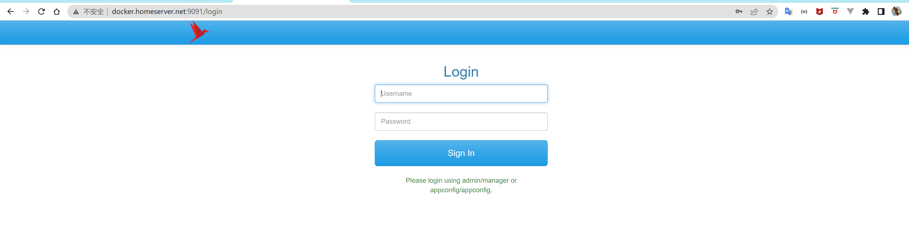
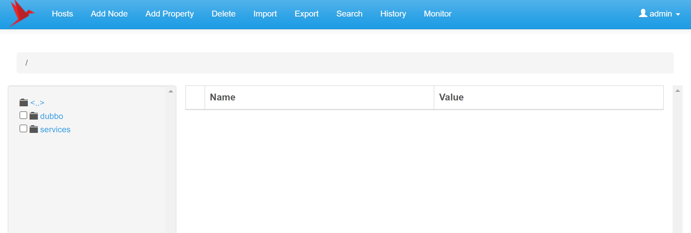

### 一、Docker进行集群部署

**S1：创建必要的目录**

```bash
# cd /home/ws/docker
# mkdir zookeeper
# mkdir zoo1 zoo2 zoo3
```

**S2：下载 zk-ui 插件，并构建 zk-ui 的 docker镜像**

```bash
# cd zookeeper
# git clone https://github.com/DeemOpen/zkui.git
正克隆到 'zkui'...
remote: Enumerating objects: 586, done.
remote: Counting objects: 100% (12/12), done.
remote: Compressing objects: 100% (12/12), done.
remote: Total 586 (delta 6), reused 0 (delta 0), pack-reused 574
接收对象中: 100% (586/586), 492.18 KiB | 401.00 KiB/s, 完成.
处理 delta 中: 100% (241/241), 完成.
```

编译并构建 zk-ui 的 docker镜像

**注意：编译这个插件，需要在虚拟机中配置 maven环境**

```bash
# cd zk-ui
# make build
```

会看到 docker镜像库中多了一个 zk-ui的镜像

```bash
REPOSITORY                                     TAG                            IMAGE ID       CREATED         SIZE
zkui                                           2.0-SNAPSHOT                   e83c736dbae8   5 days ago      657MB
redis                                          7.0.2                          2e50d70ba706   7 weeks ago     117MB
```

**S3：编写 .env 文件**

```properties
DOCKER_DOMAIN_HOST_NAME=docker.homeserver.net
DOCKER_DOMAIN_HOST_IP=192.168.3.26

ZOOKEEPER_IMAGE_VERSION=3.7
ZKUI_IMAGE_VERSION=2.0-SNAPSHOT
```

**S4：编写 docker-compose.yml文件**

```yaml
version: '3.8'

# common configurations for each zoo node
x-zoo-common: &zoo-common
  image: zookeeper:$ZOOKEEPER_IMAGE_VERSION
  privileged: true
  restart: always

services:
  zoo1:
    <<: *zoo-common
    hostname: zoo1
    container_name: zoo1
    environment:
      ZOO_MY_ID: 1
      ZOO_SERVERS: server.1=zoo1:2888:3888;2181 server.2=zoo2:2888:3888;2181 server.3=zoo3:2888:3888;2181
    ports:
      - "12181:2181"
    networks:
      - zoo-net
    volumes:
      - ./zoo1/data/:/data
      - ./zoo1/datalog/:/datalog
  zoo2:
    <<: *zoo-common
    hostname: zoo2
    container_name: zoo2
    environment:
      ZOO_MY_ID: 2
      ZOO_SERVERS: server.1=zoo1:2888:3888;2181 server.2=zoo2:2888:3888;2181 server.3=zoo3:2888:3888;2181
    ports:
      - "22181:2181"
    networks:
      - zoo-net
    volumes:
      - ./zoo2/data/:/data
      - ./zoo2/datalog/:/datalog
  zoo3:
    <<: *zoo-common
    hostname: zoo3
    container_name: zoo3
    environment:
      ZOO_MY_ID: 3
      ZOO_SERVERS: server.1=zoo1:2888:3888;2181 server.2=zoo2:2888:3888;2181 server.3=zoo3:2888:3888;2181
    ports:
      - "32181:2181"
    networks:
      - zoo-net
    volumes:
      - ./zoo3/data/:/data
      - ./zoo3/datalog/:/datalog
  zkui:
    image: zkui:$ZKUI_IMAGE_VERSION
    container_name: zkui
    restart: always
    environment:
      ZK_SERVER: zoo1:2181,zoo2:2181,zoo3:2181
    ports:
      - "9091:9090"
    depends_on:
      - zoo1
      - zoo2
      - zoo3
    networks:
      - zoo-net

networks:
  zoo-net:
    name: zoonet
    driver: bridge
    ipam:
      driver: default
      config:
        - subnet: 172.30.10.0/24
          gateway: 172.30.10.1
```

**S5：编写 operation.sh 脚本**

```bash
# touch operation.sh
# chmod +x operation.sh
# vim operation.sh
```

```bash
#!/bin/bash

docker-compose --env-file ./.env -f ./docker-compose.yml $1 $2
```

**S6：运行 脚本，启动容器**

```bash
# ./operation.sh up -d
```

**S7：zk-ui 登录**

防火墙开放 9091端口

```bash
# allow-port 9091/tcp
```

默认用户名和密码对是：admin/manager







