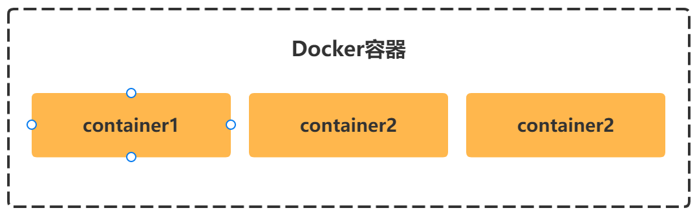
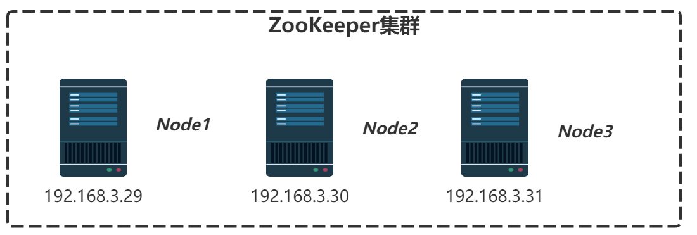
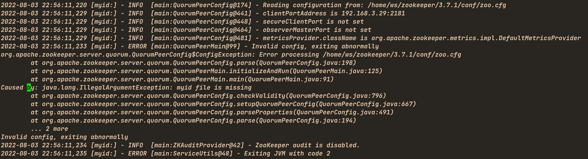

### 一、Docker进行集群部署



**S1：创建必要的目录**

```bash
# cd /home/ws/docker
# mkdir zookeeper
# mkdir zoo1 zoo2 zoo3
```

**S2：下载 zk-ui 插件，并构建 zk-ui 的 docker镜像**

```bash
# cd zookeeper
# git clone https://github.com/DeemOpen/zkui.git
正克隆到 'zkui'...
remote: Enumerating objects: 586, done.
remote: Counting objects: 100% (12/12), done.
remote: Compressing objects: 100% (12/12), done.
remote: Total 586 (delta 6), reused 0 (delta 0), pack-reused 574
接收对象中: 100% (586/586), 492.18 KiB | 401.00 KiB/s, 完成.
处理 delta 中: 100% (241/241), 完成.
```

编译并构建 zk-ui 的 docker镜像

**注意：编译这个插件，需要在虚拟机中配置 maven环境**

```bash
# cd zk-ui
# make build
```

会看到 docker镜像库中多了一个 zk-ui的镜像

```bash
REPOSITORY                                     TAG                            IMAGE ID       CREATED         SIZE
zkui                                           2.0-SNAPSHOT                   e83c736dbae8   5 days ago      657MB
redis                                          7.0.2                          2e50d70ba706   7 weeks ago     117MB
```

**S3：编写 .env 文件**

```properties
DOCKER_DOMAIN_HOST_NAME=docker.homeserver.net
DOCKER_DOMAIN_HOST_IP=192.168.3.26

ZOOKEEPER_IMAGE_VERSION=3.7
ZKUI_IMAGE_VERSION=2.0-SNAPSHOT
```

**S4：编写 docker-compose.yml文件**

```yaml
version: '3.8'

# common configurations for each zoo node
x-zoo-common: &zoo-common
  image: zookeeper:$ZOOKEEPER_IMAGE_VERSION
  privileged: true
  restart: always

services:
  zoo1:
    <<: *zoo-common
    hostname: zoo1
    container_name: zoo1
    environment:
      ZOO_MY_ID: 1
      ZOO_SERVERS: server.1=zoo1:2888:3888;2181 server.2=zoo2:2888:3888;2181 server.3=zoo3:2888:3888;2181
    ports:
      - "12181:2181"
    networks:
      - zoo-net
    volumes:
      - ./zoo1/data/:/data
      - ./zoo1/datalog/:/datalog
  zoo2:
    <<: *zoo-common
    hostname: zoo2
    container_name: zoo2
    environment:
      ZOO_MY_ID: 2
      ZOO_SERVERS: server.1=zoo1:2888:3888;2181 server.2=zoo2:2888:3888;2181 server.3=zoo3:2888:3888;2181
    ports:
      - "22181:2181"
    networks:
      - zoo-net
    volumes:
      - ./zoo2/data/:/data
      - ./zoo2/datalog/:/datalog
  zoo3:
    <<: *zoo-common
    hostname: zoo3
    container_name: zoo3
    environment:
      ZOO_MY_ID: 3
      ZOO_SERVERS: server.1=zoo1:2888:3888;2181 server.2=zoo2:2888:3888;2181 server.3=zoo3:2888:3888;2181
    ports:
      - "32181:2181"
    networks:
      - zoo-net
    volumes:
      - ./zoo3/data/:/data
      - ./zoo3/datalog/:/datalog
  zkui:
    image: zkui:$ZKUI_IMAGE_VERSION
    container_name: zkui
    restart: always
    environment:
      ZK_SERVER: zoo1:2181,zoo2:2181,zoo3:2181
    ports:
      - "9091:9090"
    depends_on:
      - zoo1
      - zoo2
      - zoo3
    networks:
      - zoo-net

networks:
  zoo-net:
    name: zoonet
    driver: bridge
    ipam:
      driver: default
      config:
        - subnet: 172.30.10.0/24
          gateway: 172.30.10.1
```

**S5：编写 operation.sh 脚本**

```bash
# touch operation.sh
# chmod +x operation.sh
# vim operation.sh
```

```bash
#!/bin/bash

docker-compose --env-file ./.env -f ./docker-compose.yml $1 $2
```

**S6：运行 脚本，启动容器**

```bash
# ./operation.sh up -d
```

**S7：zk-ui 登录**

防火墙开放 9091端口

```bash
# allow-port 9091/tcp
```

默认用户名和密码对是：admin/manager


### 二、不同虚拟机之间的集群部署

我们准备3台机器，IP地址分别是 192.168.3.29、192.168.3.30、192.168.3.31



[ZooKeeper二进制稳定版下载地址](https://www.apache.org/dyn/closer.lua/zookeeper/zookeeper-3.7.1/apache-zookeeper-3.7.1-bin.tar.gz)

以下，以 192.168.3.29 机器为例

**S1：创建目录，拷贝二进制压缩包**

```bash
# cd /home/ws
# mkdir zookeeper
# cd zookeeper
# ls
# wget https://www.apache.org/dyn/closer.lua/zookeeper/zookeeper-3.7.1/apache-zookeeper-3.7.1-bin.tar.gz
```

**S2：解压二级制压缩包，并重命名**

```bash
# tar -xf apache-zookeeper-3.7.1-bin.tar.gz
# mv apache-zookeeper-3.7.1-bin 3.7.1
```

**S3：创建并配置文件 zoo.cfg**

```bash
# cd 3.7.1
# cd conf
# cp zoo_sample.cfg zoo.cfg
# vim zoo.cfg 
```

- 如果是节点1

```properties
# The number of milliseconds of each tick
tickTime=2000

# the directory where the snapshot is stored.
# do not use /tmp for storage, /tmp here is just 
# example sakes.
#dataDir=/tmp/zookeeper
dataDir=/home/ws/zookeeper/3.7.1/data

# the port at which the clients will connect
clientPort=2181

# the client address
clientPortAddress=192.168.3.29

###########################################################################################################################
# Advanced Configurations
###########################################################################################################################

# When enabled, ZooKeeper auto purge feature retains the autopurge.snapRetainCount most recent snapshots 
#   and the corresponding transaction logs in the dataDir and dataLogDir respectively and deletes the rest.
# The default value is 3 and minimum value is 3
#autopurge.snapRetainCount=3

# The time interval in hours for which the purge task has to be triggered. 
# Set to a positive integer (1 and above) to enable the auto purging.
# The default value is 0.
#autopurge.purgeInterval=0


###########################################################################################################################
# Cluster Configurations
###########################################################################################################################

# Election implementation to use
# 1 - non-authenticated UDP-based version of fast leader election
# 2 - authenticated UDP-based version of fast leader election
# 3 - TCP-based version of fast leader election
electionAlg=3

# The number of ticks that the initial synchronization phase can take
# follows to connect ans sync to a leader
initLimit=10

# The number of ticks that can pass between 
# sending a request and getting an acknowledgement
# allow followers to sync with ZooKeeper
syncLimit=2

# when set to false, a single server can be started in replicated mode, a lone participant can run with observers, 
# and a cluster can reconfigure down to one node, and up from one node.
# The default value is true for backwards compatibility.
# It can be set using QuorumPeerConfig's setStandardaloneEnabled method 
# or by add "standaloneEnabled=false" or "standaloneEnabled=true" to a server's config file.
#standaloneEnabled=true
standaloneEnabled=false

# This controls the enabling or disabling of Dynamic Reconfiguration feature. 
# When the feature is enabled, users can perform reconfigure operations through the ZooKeeper client API 
#  or through ZooKeeper command line tools assuming users are authorized to perform such operations. 
# When the feature is disabled, no user, including the super user, can perform a reconfiguration. 
#  Any attempt to reconfigure will return an error.
# Can be set as "reconfigEnabled=false" or "reconfigEnabled=true" to a server's config file, 
# or using QuorumPeerConfig's setReconfigEnabled method.
# The default value is false.
# If present, the value should be consistent across every server in the entire ensemble. Setting the value as true 
#   on some servers and false on other servers will cause inconsistent behavior depending on which server is elected as leader.
# It is thus recommended having a consistent value for "reconfigEnabled" across servers in the ensemble
#reconfigEnabled=false

# Leader accepts client connections.
# Default value is "yes"
# The leader machine coordinates updates.
# For higher update throughput at the slight expense of read throughput, 
# the leader can be configured to not accept clients and focus on coordination.
leaderServes=yes
#leaderServes=no

# servers making up the ZooKeeper ensemble.

# Since ZooKeeper 3.6.0 it is possible to specify multiple addresses for each ZooKeeper server,
# however you have to set `multiAddress.enabled=true`, then define addresses like below:
#   server.1=zoo1-net1:2888:3888|zoo1-net2:2889:3889
#   server.2=zoo2-net1:2888:3888|zoo2-net2:2889:3889
#   server.3=zoo3-net1:2888:3888|zoo3-net2:2889:3889
server.1=zoo1:2888:3888
server.2=zoo2:2888:3888
server.3=zoo3:2888:3888

###########################################################################################################################
# Encryption, Authentication, Authorization Configurations
###########################################################################################################################

# the maximum number of client connections.
# increase this if you need to handle more clients
#maxClientCnxns=60
#
# Be sure to read the maintenance section of the 
# administrator guide before turning on autopurge.
#
# http://zookeeper.apache.org/doc/current/zookeeperAdmin.html#sc_maintenance
#
# The number of snapshots to retain in dataDir
#autopurge.snapRetainCount=3
# Purge task interval in hours
# Set to "0" to disable auto purge feature
#autopurge.purgeInterval=1


############################################################################################################################
# AdminServer Configurations
############################################################################################################################

# Set to "false" to disable the AdminServer. By default the AdminServer is enabled
# admin.enableServer=true

# The address the embedded Jetty server listens on. 
# Defaults to 0.0.0.0
# admin.serverAddress=0.0.0.0

# The port the embedded Jetty server listens on. Defaults to 8080
admin.serverPort=18080

# Set the maximum idle time in milliseconds that a connection can wait before sending or receiving data
# admin.idleTimeout=30000

# The URL for listing and issuing commands relative to the root URL
# admin.commandURL=/commands

############################################################################################################################
# Metrics Providers
############################################################################################################################

# https://prometheus.io Metrics Exporter
#metricsProvider.className=org.apache.zookeeper.metrics.prometheus.PrometheusMetricsProvider
#metricsProvider.httpPort=7000
#metricsProvider.exportJvmInfo=true
```

- 如果是节点2

```properties
# The number of milliseconds of each tick
tickTime=2000

# the directory where the snapshot is stored.
# do not use /tmp for storage, /tmp here is just 
# example sakes.
#dataDir=/tmp/zookeeper
dataDir=/home/ws/zookeeper/3.7.1/data

# the port at which the clients will connect
clientPort=2181

# the client address
clientPortAddress=192.168.3.30

###########################################################################################################################
# Advanced Configurations
###########################################################################################################################

# When enabled, ZooKeeper auto purge feature retains the autopurge.snapRetainCount most recent snapshots 
#   and the corresponding transaction logs in the dataDir and dataLogDir respectively and deletes the rest.
# The default value is 3 and minimum value is 3
#autopurge.snapRetainCount=3

# The time interval in hours for which the purge task has to be triggered. 
# Set to a positive integer (1 and above) to enable the auto purging.
# The default value is 0.
#autopurge.purgeInterval=0


###########################################################################################################################
# Cluster Configurations
###########################################################################################################################

# Election implementation to use
# 1 - non-authenticated UDP-based version of fast leader election
# 2 - authenticated UDP-based version of fast leader election
# 3 - TCP-based version of fast leader election
electionAlg=3

# The number of ticks that the initial synchronization phase can take
# follows to connect ans sync to a leader
initLimit=10

# The number of ticks that can pass between 
# sending a request and getting an acknowledgement
# allow followers to sync with ZooKeeper
syncLimit=2

# when set to false, a single server can be started in replicated mode, a lone participant can run with observers, 
# and a cluster can reconfigure down to one node, and up from one node.
# The default value is true for backwards compatibility.
# It can be set using QuorumPeerConfig's setStandardaloneEnabled method 
# or by add "standaloneEnabled=false" or "standaloneEnabled=true" to a server's config file.
#standaloneEnabled=true
standaloneEnabled=false

# This controls the enabling or disabling of Dynamic Reconfiguration feature. 
# When the feature is enabled, users can perform reconfigure operations through the ZooKeeper client API 
#  or through ZooKeeper command line tools assuming users are authorized to perform such operations. 
# When the feature is disabled, no user, including the super user, can perform a reconfiguration. 
#  Any attempt to reconfigure will return an error.
# Can be set as "reconfigEnabled=false" or "reconfigEnabled=true" to a server's config file, 
# or using QuorumPeerConfig's setReconfigEnabled method.
# The default value is false.
# If present, the value should be consistent across every server in the entire ensemble. Setting the value as true 
#   on some servers and false on other servers will cause inconsistent behavior depending on which server is elected as leader.
# It is thus recommended having a consistent value for "reconfigEnabled" across servers in the ensemble
#reconfigEnabled=false

# Leader accepts client connections.
# Default value is "yes"
# The leader machine coordinates updates.
# For higher update throughput at the slight expense of read throughput, 
# the leader can be configured to not accept clients and focus on coordination.
leaderServes=yes
#leaderServes=no

# servers making up the ZooKeeper ensemble.

# Since ZooKeeper 3.6.0 it is possible to specify multiple addresses for each ZooKeeper server,
# however you have to set `multiAddress.enabled=true`, then define addresses like below:
#   server.1=zoo1-net1:2888:3888|zoo1-net2:2889:3889
#   server.2=zoo2-net1:2888:3888|zoo2-net2:2889:3889
#   server.3=zoo3-net1:2888:3888|zoo3-net2:2889:3889
server.1=zoo1:2888:3888
server.2=zoo2:2888:3888
server.3=zoo3:2888:3888

###########################################################################################################################
# Encryption, Authentication, Authorization Configurations
###########################################################################################################################

# the maximum number of client connections.
# increase this if you need to handle more clients
#maxClientCnxns=60
#
# Be sure to read the maintenance section of the 
# administrator guide before turning on autopurge.
#
# http://zookeeper.apache.org/doc/current/zookeeperAdmin.html#sc_maintenance
#
# The number of snapshots to retain in dataDir
#autopurge.snapRetainCount=3
# Purge task interval in hours
# Set to "0" to disable auto purge feature
#autopurge.purgeInterval=1


############################################################################################################################
# AdminServer Configurations
############################################################################################################################

# Set to "false" to disable the AdminServer. By default the AdminServer is enabled
# admin.enableServer=true

# The address the embedded Jetty server listens on. 
# Defaults to 0.0.0.0
# admin.serverAddress=0.0.0.0

# The port the embedded Jetty server listens on. Defaults to 8080
admin.serverPort=18080

# Set the maximum idle time in milliseconds that a connection can wait before sending or receiving data
# admin.idleTimeout=30000

# The URL for listing and issuing commands relative to the root URL
# admin.commandURL=/commands

############################################################################################################################
# Metrics Providers
############################################################################################################################

# https://prometheus.io Metrics Exporter
#metricsProvider.className=org.apache.zookeeper.metrics.prometheus.PrometheusMetricsProvider
#metricsProvider.httpPort=7000
#metricsProvider.exportJvmInfo=true
```

- 如果是节点3

```properties
# The number of milliseconds of each tick
tickTime=2000

# the directory where the snapshot is stored.
# do not use /tmp for storage, /tmp here is just 
# example sakes.
#dataDir=/tmp/zookeeper
dataDir=/home/ws/zookeeper/3.7.1/data

# the port at which the clients will connect
clientPort=2181

# the client address
clientPortAddress=192.168.3.31

###########################################################################################################################
# Advanced Configurations
###########################################################################################################################

# When enabled, ZooKeeper auto purge feature retains the autopurge.snapRetainCount most recent snapshots 
#   and the corresponding transaction logs in the dataDir and dataLogDir respectively and deletes the rest.
# The default value is 3 and minimum value is 3
#autopurge.snapRetainCount=3

# The time interval in hours for which the purge task has to be triggered. 
# Set to a positive integer (1 and above) to enable the auto purging.
# The default value is 0.
#autopurge.purgeInterval=0


###########################################################################################################################
# Cluster Configurations
###########################################################################################################################

# Election implementation to use
# 1 - non-authenticated UDP-based version of fast leader election
# 2 - authenticated UDP-based version of fast leader election
# 3 - TCP-based version of fast leader election
electionAlg=3

# The number of ticks that the initial synchronization phase can take
# follows to connect ans sync to a leader
initLimit=10

# The number of ticks that can pass between 
# sending a request and getting an acknowledgement
# allow followers to sync with ZooKeeper
syncLimit=2

# when set to false, a single server can be started in replicated mode, a lone participant can run with observers, 
# and a cluster can reconfigure down to one node, and up from one node.
# The default value is true for backwards compatibility.
# It can be set using QuorumPeerConfig's setStandardaloneEnabled method 
# or by add "standaloneEnabled=false" or "standaloneEnabled=true" to a server's config file.
#standaloneEnabled=true
standaloneEnabled=false

# This controls the enabling or disabling of Dynamic Reconfiguration feature. 
# When the feature is enabled, users can perform reconfigure operations through the ZooKeeper client API 
#  or through ZooKeeper command line tools assuming users are authorized to perform such operations. 
# When the feature is disabled, no user, including the super user, can perform a reconfiguration. 
#  Any attempt to reconfigure will return an error.
# Can be set as "reconfigEnabled=false" or "reconfigEnabled=true" to a server's config file, 
# or using QuorumPeerConfig's setReconfigEnabled method.
# The default value is false.
# If present, the value should be consistent across every server in the entire ensemble. Setting the value as true 
#   on some servers and false on other servers will cause inconsistent behavior depending on which server is elected as leader.
# It is thus recommended having a consistent value for "reconfigEnabled" across servers in the ensemble
#reconfigEnabled=false

# Leader accepts client connections.
# Default value is "yes"
# The leader machine coordinates updates.
# For higher update throughput at the slight expense of read throughput, 
# the leader can be configured to not accept clients and focus on coordination.
leaderServes=yes
#leaderServes=no

# servers making up the ZooKeeper ensemble.

# Since ZooKeeper 3.6.0 it is possible to specify multiple addresses for each ZooKeeper server,
# however you have to set `multiAddress.enabled=true`, then define addresses like below:
#   server.1=zoo1-net1:2888:3888|zoo1-net2:2889:3889
#   server.2=zoo2-net1:2888:3888|zoo2-net2:2889:3889
#   server.3=zoo3-net1:2888:3888|zoo3-net2:2889:3889
server.1=zoo1:2888:3888
server.2=zoo2:2888:3888
server.3=zoo3:2888:3888

###########################################################################################################################
# Encryption, Authentication, Authorization Configurations
###########################################################################################################################

# the maximum number of client connections.
# increase this if you need to handle more clients
#maxClientCnxns=60
#
# Be sure to read the maintenance section of the 
# administrator guide before turning on autopurge.
#
# http://zookeeper.apache.org/doc/current/zookeeperAdmin.html#sc_maintenance
#
# The number of snapshots to retain in dataDir
#autopurge.snapRetainCount=3
# Purge task interval in hours
# Set to "0" to disable auto purge feature
#autopurge.purgeInterval=1


############################################################################################################################
# AdminServer Configurations
############################################################################################################################

# Set to "false" to disable the AdminServer. By default the AdminServer is enabled
# admin.enableServer=true

# The address the embedded Jetty server listens on. 
# Defaults to 0.0.0.0
# admin.serverAddress=0.0.0.0

# The port the embedded Jetty server listens on. Defaults to 8080
admin.serverPort=18080

# Set the maximum idle time in milliseconds that a connection can wait before sending or receiving data
# admin.idleTimeout=30000

# The URL for listing and issuing commands relative to the root URL
# admin.commandURL=/commands

############################################################################################################################
# Metrics Providers
############################################################################################################################

# https://prometheus.io Metrics Exporter
#metricsProvider.className=org.apache.zookeeper.metrics.prometheus.PrometheusMetricsProvider
#metricsProvider.httpPort=7000
#metricsProvider.exportJvmInfo=true
```

**S4：创建 data目录，并创建 myid文件**

myid文件作用：标识每个节点

说明：如果不创建 myid 文件，服务将无法启动，会报以下错误



```bash
# cd /home/ws/zookeeper/3.7.1
# mkdir data
# cd data
# echo 1 >> myid
```

myid文件中只有当前节点标识，

- 如果是节点1，文件内容为 1

  ```
  1
  ```

- 如果是节点2，文件内容为 2

  ```
  2
  ```

- 如果是节点3，文件内容为 3

  ```
  3
  ```

**S5：配置hosts文件**

`zoo1`，`zoo2`，`zoo3` 与 `zoo.cfg`中 *server.1*, *server.2*, *server.3*配置中的相对应

```bash
# vim /etc/hosts
```

```
192.168.3.29 zoo1
192.168.3.30 zoo2
192.168.3.31 zoo3
```

**S6：开放必要端口**

```bash
# allow-port 2181/tcp
# allow-port 2888/tcp
# allow-port 3888/tcp
# allow-port 18080/tcp
```

**S7：编写运行脚本**

```bash
# cd /home/ws/zookeeper/3.7.1
# touch start-server.sh
# chmod a+x start-server.sh
# vim start-server.sh
```

start-server.sh

```bash
#!/bin/sh

sh bin/zkServer.sh --config /home/ws/zookeeper/3.7.1/conf $1 $2 $3 $4 $5 $6
```

**S8：启动运行脚本**

依次启动每个节点

```bash
# ./start-server start
```

